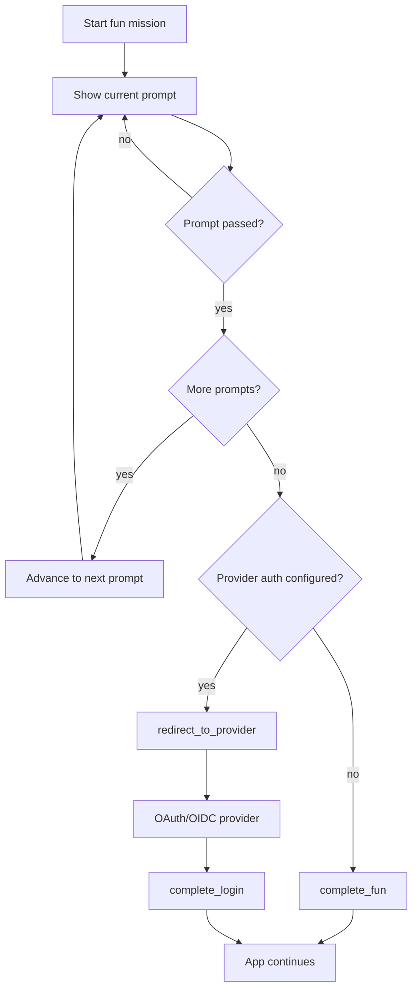

# funthenticate

The world keeps getting more serious, and login is usually one of its most serious little chores. Funthenticate gives that moment a grin: a playful Authlib wrapper that lets your app ask users to draw a key, crack a conversion lock, gamble on a secret number, or click the world's most confident popup. Stop there for a purely fun gate, or continue into a real OAuth/OIDC redirect when the stakes actually call for it.

When you do need real authentication, the important part stays intentionally boring: Authlib and your identity provider do the identity work. Funthenticate adds optional rituals, sequenced challenge state, deterministic welcome badges, and provider helpers so login feels less like a gray door and more like a tiny moment of relief.

Do not use these challenges as identity proof by themselves. They are theatrical velvet ropes, onboarding rituals, or small morale machines. Pair them with Microsoft Entra ID, Google, Okta, or another OIDC provider whenever identity actually matters.

## Features

- Authlib wrapper for Flask-backed OAuth/OIDC flows
- Google and Microsoft Entra provider helpers
- Drawing, conversion, operator-guessing, popup, and chance-based login rituals
- Fun-only missions that do not need a provider redirect
- Prompt sequences so multiple rituals can be chained together

## Install

```powershell
uv add funthenticate
```

For provider-backed OAuth/OIDC flows, install the Authlib extra:

```powershell
uv add "funthenticate[auth]"
```

For local development:

```powershell
uv sync
uv run pytest tests -xvs
uv run ruff check .
uv run ruff format . --check
```

## Basic Flask Flow

Funthenticate can be used as a fun-only gate or as a playful pre-step before Authlib.



### Fun-Only Flow

```python
from flask import Flask, redirect, session

from funthenticate import FunAuth

app = Flask(__name__)
app.secret_key = "replace-me"

auth = FunAuth()


@app.get("/login")
def login():
    mission = auth.prepare_mission(
        session,
        next_url="/dashboard",
        prompt_keys=("authorized-popup", "number-guess"),
    )
    return mission.prompt.prompt


@app.post("/login/popup")
def answer_popup():
    result = auth.answer_popup(session, accepted=True)
    if not result.passed:
        return result.message, 400
    return auth.current_mission(session).prompt.prompt


@app.post("/login/guess")
def answer_guess():
    result = auth.answer_number_guess(session, 7)
    if not result.passed:
        return result.message, 400
    done = auth.complete_fun(session)
    return redirect(done.next_url or "/")
```

### Provider Flow

```python
from flask import Flask, redirect, request, session, url_for

from funthenticate import FunAuth, google_provider

app = Flask(__name__)
app.secret_key = "replace-me"

auth = FunAuth.for_flask_app(app, trusted_email_domains=["example.com"])
auth.register_provider(google_provider("client-id", "client-secret"))


@app.get("/login")
def login():
    mission = auth.prepare_mission(
        session,
        "google",
        next_url="/dashboard",
        prompt_key="authorized-popup",
    )
    return mission.prompt.prompt


@app.post("/login/popup")
def answer_popup():
    result = auth.answer_popup(session, accepted=True)
    if not result.passed:
        return result.message, 400
    return auth.redirect_to_provider(session, url_for("auth_callback", _external=True))


@app.get("/auth/callback")
def auth_callback():
    result = auth.complete_login(session)
    session["user"] = result.identity.to_session()
    session["welcome_badge"] = result.welcome.badge
    return redirect(result.next_url or "/")
```

## Built-In Prompts

`default_fun_prompts()` currently includes:

- `draw-key`: draw a simple key shape
- `conversion-lock`: solve a numeric conversion chain
- `operator-conversion-lock`: infer the hidden operators between converted numbers
- `number-guess`: guess a secret number
- `authorized-popup`: acknowledge `I'm authorized`

Select a prompt when preparing login:

```python
mission = auth.prepare_mission(session, "google", prompt_key="draw-key")
```

For multiple prompts in sequence, pass `prompt_keys` instead:

```python
mission = auth.prepare_mission(
    session,
    "google",
    prompt_keys=("authorized-popup", "draw-key", "operator-conversion-lock"),
)
```

`prepare_login(...)` remains available as a compatibility alias, but new code should prefer `prepare_mission(...)`. After each successful answer, `auth.current_mission(session)` returns the next prompt. Once the final prompt passes, use `auth.complete_fun(session)` for fun-only flows or `auth.redirect_to_provider(...)` for real provider authentication.

## Built-In UI

Funthenticate includes a small renderer and stylesheet for apps that want a nicer default screen without choosing a frontend framework yet.

```python
from flask import Response, session

from funthenticate import FunAuth, default_stylesheet, render_prompt_card

auth = FunAuth()


@app.get("/funthenticate.css")
def funthenticate_css():
    return Response(default_stylesheet(), mimetype="text/css")


@app.get("/login")
def login():
    mission = auth.prepare_mission(
        session,
        next_url="/dashboard",
        prompt_keys=("authorized-popup", "operator-conversion-lock"),
    )
    return render_page(render_prompt_card(mission, action="/login/popup"))


def render_page(card_html: str) -> str:
    return f"""
    <!doctype html>
    <html lang="en">
      <head>
        <meta charset="utf-8">
        <meta name="viewport" content="width=device-width, initial-scale=1">
        <link rel="stylesheet" href="/funthenticate.css">
        <title>Funthenticate</title>
      </head>
      <body>{card_html}</body>
    </html>
    """
```

## Drawing Challenge

The drawing challenge compares the drawn form, not the canvas. It crops the submitted strokes to their own bounding box, rescales them into a normalized grid, centers them, rasterizes the strokes, and compares the result against a template with a tolerance radius.

```python
mission = auth.prepare_mission(session, "google", prompt_key="draw-key")

strokes = [
    [(100, 50), (120, 34), (144, 34), (164, 50), (144, 66), (120, 66), (100, 50)],
    [(164, 50), (256, 50), (256, 68), (274, 68), (274, 50), (294, 50), (294, 74)],
]

result = auth.answer_drawing(session, strokes)
```

`result.score` tells the UI how close the drawing was. `result.passed` decides whether the user may continue to the provider.

## Conversion Lock

A conversion lock asks for intermediate answers. Each step can be only an operation, only a conversion, or both at once.

```python
from funthenticate import build_conversion_challenge

challenge = build_conversion_challenge(
    start_value=13,
    steps=[
        {"kind": "add", "operand": 5, "convert_to": "hex"},
        {"kind": "multiply", "operand": 3, "conversion": "bin"},
        {"kind": "subtract", "operand": 7, "base": 8},
    ],
)

result = challenge.evaluate(["0x12", "0b110110", "0o57"])
```

The same challenge can be attached to a prompt and answered through the session helper:

```python
auth.prepare_mission(session, "google", prompt_key="conversion-lock")
result = auth.answer_conversion(session, ["0x12", "0b110110", "0o57"])
```

Supported operations:

- `add`
- `subtract`
- `multiply`
- `integer_divide`
- `modulo`
- `power`
- `identity`

Supported output bases:

- decimal: `10`, `dec`, `decimal`
- hexadecimal: `16`, `hex`, `hexadecimal`
- binary: `2`, `bin`, `binary`
- octal: `8`, `oct`, `octal`

Answers may include prefixes or omit them. For example, both `0x12` and `12` are accepted for a hexadecimal answer.

### Operator Guess Mode

Sometimes the user should see only the converted numbers and supply the operators or base conversions that connect them. The user is not allowed to type operands, because `+5` gives away too much of the game. Instead, Funthenticate keeps the configured operands hidden, parses moves like `+ hex`, applies the hidden operand to the previous numeric value, and checks whether the computed result lands on the next shown value.

```python
from funthenticate import build_conversion_operator_guess_challenge

challenge = build_conversion_operator_guess_challenge(
    start_value=13,
    steps=[
        {"kind": "add", "operand": 5, "convert_to": "hex"},
        {"kind": "multiply", "operand": 3, "conversion": "bin"},
        {"kind": "subtract", "operand": 7, "base": 8},
    ],
)

assert challenge.display_values() == ("13", "0x12", "0b110110", "0o57")
result = challenge.evaluate(["+ hex", "* bin", "- oct"])
```

Use the built-in prompt when you want this as the login ritual:

```python
auth.prepare_mission(session, "google", prompt_key="operator-conversion-lock")
result = auth.answer_conversion_operators(session, ["+ hex", "* bin", "- oct"])
```

Accepted move answers include symbolic and word forms, without numbers:

- `+`
- `-`
- `*`
- `//`
- `%`
- `**`
- `add`
- `mul`
- `hex`
- `bin`
- `oct`
- `dec`
- `+ hex`
- `mul bin`

## Number Guessing

The number guessing game is deliberately unfair in a charming way: the secret answer is generated at random inside the configured range when the challenge starts. The user gets a limited number of tries. If they fail, the target is re-rolled, the attempt counter is reset, and the failure message makes it very clear who is to blame.

The target and attempt count live in server-side challenge state instead of the browser session, so every login attempt can have its own little pocket of chance without leaking the answer into client-visible data. The default `InMemoryFunStateStore` is fine for local demos; production apps should pass a shared store implementation if they run multiple processes or servers.

```python
from funthenticate import FunPrompt, NumberGuessChallenge, PromptDeck

challenge = NumberGuessChallenge(
    key="guess-small",
    range_min=1,
    range_max=5,
    max_tries=3,
)

prompt = FunPrompt(
    key="guess-small",
    title="Guess Small",
    prompt="Guess the secret number.",
    options=(),
    success_message=challenge.success_message,
    failure_message=challenge.failure_message,
    number_guess=challenge,
)

auth = FunAuth(oauth, prompt_deck=PromptDeck((prompt,)))
auth.prepare_mission(session, "google", prompt_key="guess-small")
result = auth.answer_number_guess(session, 4)
```

Feedback includes:

- `correct`
- `too-low`
- `too-high`

What happens under the hood:

- If no target exists yet, Funthenticate generates one with `secrets.randbelow(...)` inside `range_min..range_max`.
- Each wrong guess consumes one try and returns a directional hint.
- If the user runs out of tries, Funthenticate generates a fresh target and resets attempts to `0`.
- The default failure message is intentionally petty: `You failed to guess the number in time. This is your failure; the game has reset.`

That means the challenge is genuinely up to chance. The user cannot memorize a static answer between failed rounds, because failure burns the old target and starts a new tiny game.

## Popup Acknowledgement

For the simplest possible ritual, use `authorized-popup`:

```python
auth.prepare_mission(session, "google", prompt_key="authorized-popup")
result = auth.answer_popup(session, accepted=True)
```

The prompt message is `I'm authorized`. If accepted, the challenge passes.

## Custom Multiple-Choice Prompts

The default prompt deck no longer includes multiple-choice prompts, but the building blocks are still available for apps that want them:

```python
from funthenticate import FunPrompt, FunPromptOption, PromptDeck

prompt = FunPrompt(
    key="custom-choice",
    title="Custom Choice",
    prompt="Pick the right option.",
    options=(
        FunPromptOption("yes", "Yes", is_correct=True),
        FunPromptOption("no", "No"),
    ),
    success_message="Correct.",
    failure_message="Try again.",
)

auth = FunAuth(oauth, prompt_deck=PromptDeck((prompt,)))
auth.prepare_mission(session, "google", prompt_key="custom-choice")
result = auth.answer_prompt(session, "yes")
```

## Provider Helpers

Provider helpers require the `auth` extra:

```powershell
uv add "funthenticate[auth]"
```

```python
from funthenticate import google_provider, microsoft_entra_provider

auth.register_provider(google_provider("client-id", "client-secret"))
auth.register_provider(
    microsoft_entra_provider(
        "client-id",
        "client-secret",
        tenant_id="organizations",
    )
)
```

## Security Notes

Funthenticate challenges are not password replacements and not second factors. They are playful gates, not identity proof. Use OIDC, passkeys, MFA, conditional access, and domain restrictions for actual security.

By default, `next_url` must be a same-site absolute path such as `/dashboard`. Pass a custom `next_url_validator` to `FunAuth` if your app needs stricter routing rules.

For production number-guessing missions, pass a shared `FunStateStore` implementation instead of relying on the default in-memory store. The store only needs to implement `get_number_guess`, `save_number_guess`, and `clear_mission`, so Redis, a database table, or your web framework's cache all work well.

```python
from funthenticate import FunAuth

auth = FunAuth(state_store=my_shared_store)
```

Good uses:

- Make internal tools feel more human
- Add a low-stakes pre-login ritual
- Teach users a tiny workflow concept before entering an app
- Add memorable onboarding around SSO

Bad uses:

- Replacing OAuth/OIDC
- Protecting sensitive data with only a drawing or guessing game
- Treating a popup acknowledgement as identity verification

## Development

```powershell
uv sync
uv run pytest tests -xvs
uv run ruff check .
uv run ruff format .
```
