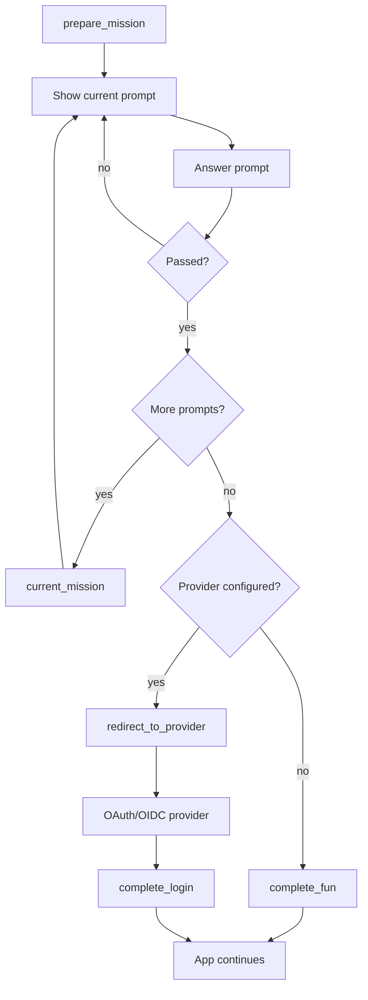

# funthenticate

Login is usually a gray door: click, redirect, consent, callback, done. `funthenticate` turns that little threshold into a tiny ritual.

Ask someone to draw a key. Make them unlock a conversion puzzle. Let them gamble against a secret number. Show the most suspiciously confident popup in auth history. Then either stop there for a harmless fun gate, or continue into real OAuth/OIDC through Authlib when identity actually matters.

The serious layer stays serious: Google, Microsoft Entra ID, Okta, or any OIDC provider still proves who the user is. `funthenticate` adds the memorable prelude around it: prompt sequences, challenge state, welcome badges, provider helpers, and a small built-in UI for Flask apps that want to feel a little less like a filing cabinet.

> These challenges are not passwords, MFA, or identity proof. They are theatrical velvet ropes. Delightful velvet ropes, but still velvet.

## Why Use It?

- Add a low-stakes ritual before SSO without replacing SSO.
- Make internal tools, demos, labs, and onboarding flows feel more human.
- Chain multiple prompts into a small login ceremony.
- Run fun-only gates without OAuth, or redirect to Authlib/OIDC after the ritual passes.
- Ship quickly with built-in prompt cards, CSS, provider helpers, and typed Python APIs.

## Current Features

- Flask-friendly `FunAuth` flow manager.
- Optional Authlib/OIDC integration via `funthenticate[auth]`.
- Google and Microsoft Entra provider helpers.
- Built-in prompt deck: drawing, conversion lock, operator conversion lock, number guessing, and popup acknowledgement.
- Prompt sequences with progress tracking.
- Fun-only missions using `complete_fun(...)`.
- Provider-backed missions using `redirect_to_provider(...)` and `complete_login(...)`.
- Deterministic welcome badges after a successful mission.
- Built-in HTML renderer and bundled stylesheet.
- CLI helpers for discovering prompts and idea keys.
- Typed package metadata via `py.typed`.

## Install

```powershell
uv add funthenticate
```

For OAuth/OIDC provider flows, install the Authlib extra:

```powershell
uv add "funthenticate[auth]"
```

For local development:

```powershell
uv sync
uv run pytest tests -xvs
uv run ruff check .
uv run ruff format . --check
```

## Five-Minute Fun Gate

This example creates a two-step fun-only gate: accept the popup, solve the number guess, then continue to `/dashboard`.

```python
from flask import Flask, redirect, request, session

from funthenticate import FunAuth

app = Flask(__name__)
app.secret_key = "replace-me"

auth = FunAuth()


@app.get("/login")
def login():
    mission = auth.prepare_mission(
        session,
        next_url="/dashboard",
        prompt_keys=("authorized-popup", "number-guess"),
    )
    return mission.prompt.prompt


@app.post("/login/popup")
def answer_popup():
    result = auth.answer_popup(session, accepted=True)
    if not result.passed:
        return result.message, 400
    return auth.current_mission(session).prompt.prompt


@app.post("/login/guess")
def answer_guess():
    result = auth.answer_number_guess(session, int(request.form["guess"]))
    if not result.passed:
        return result.message, 400
    done = auth.complete_fun(session)
    return redirect(done.next_url or "/")
```

## OAuth/OIDC Flow

Use the ritual as a pre-step, then hand off to the actual provider.

```python
from flask import Flask, redirect, session, url_for

from funthenticate import FunAuth, google_provider

app = Flask(__name__)
app.secret_key = "replace-me"

auth = FunAuth.for_flask_app(app, trusted_email_domains=["example.com"])
auth.register_provider(google_provider("client-id", "client-secret"))


@app.get("/login")
def login():
    mission = auth.prepare_mission(
        session,
        "google",
        next_url="/dashboard",
        prompt_key="authorized-popup",
    )
    return mission.prompt.prompt


@app.post("/login/popup")
def answer_popup():
    result = auth.answer_popup(session, accepted=True)
    if not result.passed:
        return result.message, 400
    return auth.redirect_to_provider(session, url_for("auth_callback", _external=True))


@app.get("/auth/callback")
def auth_callback():
    result = auth.complete_login(session)
    session["user"] = result.identity.to_session()
    session["welcome_badge"] = result.welcome.badge
    return redirect(result.next_url or "/")
```

## Flow Shape



## Built-In Prompts

`default_fun_prompts()` currently includes:

- `draw-key`: draw a simple key shape.
- `conversion-lock`: solve a numeric conversion chain.
- `operator-conversion-lock`: infer the hidden operators between converted numbers.
- `number-guess`: guess a secret number with limited tries.
- `authorized-popup`: acknowledge `I'm authorized`.

Use one prompt:

```python
mission = auth.prepare_mission(session, "google", prompt_key="draw-key")
```

Or chain several:

```python
mission = auth.prepare_mission(
    session,
    "google",
    prompt_keys=("authorized-popup", "draw-key", "operator-conversion-lock"),
)
```

`prepare_login(...)` is still available as a compatibility alias. New code should prefer `prepare_mission(...)`, because missions can be fun-only or provider-backed.

## Built-In UI

`render_prompt_card(...)` and `default_stylesheet()` give you a polished default screen without committing to a frontend framework.

```python
from flask import Response, session

from funthenticate import FunAuth, default_stylesheet, render_prompt_card

auth = FunAuth()


@app.get("/funthenticate.css")
def funthenticate_css():
    return Response(default_stylesheet(), mimetype="text/css")


@app.get("/login")
def login():
    mission = auth.prepare_mission(
        session,
        next_url="/dashboard",
        prompt_keys=("authorized-popup", "operator-conversion-lock"),
    )
    return render_page(render_prompt_card(mission, action="/login/answer"))


def render_page(card_html: str) -> str:
    return f"""
    <!doctype html>
    <html lang="en">
      <head>
        <meta charset="utf-8">
        <meta name="viewport" content="width=device-width, initial-scale=1">
        <link rel="stylesheet" href="/funthenticate.css">
        <title>Funthenticate</title>
      </head>
      <body>{card_html}</body>
    </html>
    """
```

## CLI

The package installs a small discovery CLI:

```powershell
uv run funthenticate
uv run funthenticate prompts
uv run funthenticate ideas
uv run funthenticate demo-sequence
uv run funthenticate prompts --json
```

## Challenge Notes

### Drawing

The drawing challenge compares the form of the submitted strokes, not the original canvas size or position. It crops, rescales, centers, rasterizes, and compares the drawing against a template with tolerance.

```python
mission = auth.prepare_mission(session, "google", prompt_key="draw-key")

strokes = [
    [(100, 50), (120, 34), (144, 34), (164, 50), (144, 66), (120, 66), (100, 50)],
    [(164, 50), (256, 50), (256, 68), (274, 68), (274, 50), (294, 50), (294, 74)],
]

result = auth.answer_drawing(session, strokes)
```

`result.score` reports closeness. `result.passed` decides whether the user may continue.

### Conversion Lock

A conversion lock asks for intermediate numeric answers. Each step can transform the value, convert the output base, or both.

```python
from funthenticate import build_conversion_challenge

challenge = build_conversion_challenge(
    start_value=13,
    steps=[
        {"kind": "add", "operand": 5, "convert_to": "hex"},
        {"kind": "multiply", "operand": 3, "conversion": "bin"},
        {"kind": "subtract", "operand": 7, "base": 8},
    ],
)

result = challenge.evaluate(["0x12", "0b110110", "0o57"])
```

Supported operations: `add`, `subtract`, `multiply`, `integer_divide`, `modulo`, `power`, `identity`.

Supported bases: decimal, hexadecimal, binary, and octal. Prefixed and prefixless answers are accepted where appropriate, so `0x12` and `12` can both satisfy a hexadecimal answer.

### Operator Conversion Lock

Operator mode shows the converted values and asks the user to infer what connects them. The configured operands stay hidden, which keeps the game from becoming a copy exercise.

```python
from funthenticate import build_conversion_operator_guess_challenge

challenge = build_conversion_operator_guess_challenge(
    start_value=13,
    steps=[
        {"kind": "add", "operand": 5, "convert_to": "hex"},
        {"kind": "multiply", "operand": 3, "conversion": "bin"},
        {"kind": "subtract", "operand": 7, "base": 8},
    ],
)

assert challenge.display_values() == ("13", "0x12", "0b110110", "0o57")
result = challenge.evaluate(["+ hex", "* bin", "- oct"])
```

Use it through a session mission:

```python
auth.prepare_mission(session, "google", prompt_key="operator-conversion-lock")
result = auth.answer_conversion_operators(session, ["+ hex", "* bin", "- oct"])
```

Accepted move forms include symbols and base names such as `+`, `*`, `//`, `%`, `**`, `hex`, `bin`, `oct`, `dec`, `+ hex`, and `mul bin`.

### Number Guessing

The number guessing challenge is intentionally chance-flavored. A secret target is generated with `secrets.randbelow(...)`, wrong guesses give directional feedback, and failed rounds reset with a new target.

```python
from funthenticate import FunAuth, FunPrompt, NumberGuessChallenge, PromptDeck

challenge = NumberGuessChallenge(
    key="guess-small",
    range_min=1,
    range_max=5,
    max_tries=3,
)

prompt = FunPrompt(
    key="guess-small",
    title="Guess Small",
    prompt="Guess the secret number.",
    options=(),
    success_message=challenge.success_message,
    failure_message=challenge.failure_message,
    number_guess=challenge,
)

auth = FunAuth(prompt_deck=PromptDeck((prompt,)))
auth.prepare_mission(session, "google", prompt_key="guess-small")
result = auth.answer_number_guess(session, 4)
```

Feedback includes `correct`, `too-low`, and `too-high`.

For production deployments with multiple workers, pass a shared `FunStateStore` implementation instead of relying on the default in-memory store.

```python
auth = FunAuth(state_store=my_shared_store)
```

The store only needs to implement `get_number_guess`, `save_number_guess`, and `clear_mission`.

### Popup Acknowledgement

The simplest ritual is `authorized-popup`:

```python
auth.prepare_mission(session, "google", prompt_key="authorized-popup")
result = auth.answer_popup(session, accepted=True)
```

The prompt says `I'm authorized`. If accepted, the challenge passes.

### Custom Multiple Choice

The default deck does not include multiple-choice prompts, but the building blocks are available.

```python
from funthenticate import FunPrompt, FunPromptOption, PromptDeck

prompt = FunPrompt(
    key="custom-choice",
    title="Custom Choice",
    prompt="Pick the right option.",
    options=(
        FunPromptOption("yes", "Yes", is_correct=True),
        FunPromptOption("no", "No"),
    ),
    success_message="Correct.",
    failure_message="Try again.",
)

auth = FunAuth(prompt_deck=PromptDeck((prompt,)))
auth.prepare_mission(session, "google", prompt_key="custom-choice")
result = auth.answer_prompt(session, "yes")
```

## Provider Helpers

Provider helpers require `funthenticate[auth]`.

```python
from funthenticate import google_provider, microsoft_entra_provider

auth.register_provider(google_provider("client-id", "client-secret"))
auth.register_provider(
    microsoft_entra_provider(
        "client-id",
        "client-secret",
        tenant_id="organizations",
    )
)
```

## Security Notes

`funthenticate` is not a replacement for OAuth, OIDC, passkeys, MFA, conditional access, or server-side authorization. Use the rituals for mood, onboarding, pacing, demos, and low-stakes gates. Use real authentication and authorization for real trust decisions.

By default, `next_url` must be a same-site absolute path such as `/dashboard`. Pass a custom `next_url_validator` to `FunAuth` if your app needs stricter routing rules.

Good uses:

- Make internal tools feel more human.
- Add a memorable pre-login ritual before SSO.
- Teach a small workflow concept before entering an app.
- Build playful demos, hackathon apps, onboarding labs, or team portals.

Bad uses:

- Replacing OAuth/OIDC.
- Protecting sensitive data with only a drawing or guessing game.
- Treating a popup acknowledgement as identity verification.

## Development

```powershell
uv sync
uv run pytest tests -xvs
uv run ruff check .
uv run ruff format .
uv run python -m build
```

Publishing notes live in `PUBLISHING.md`.
